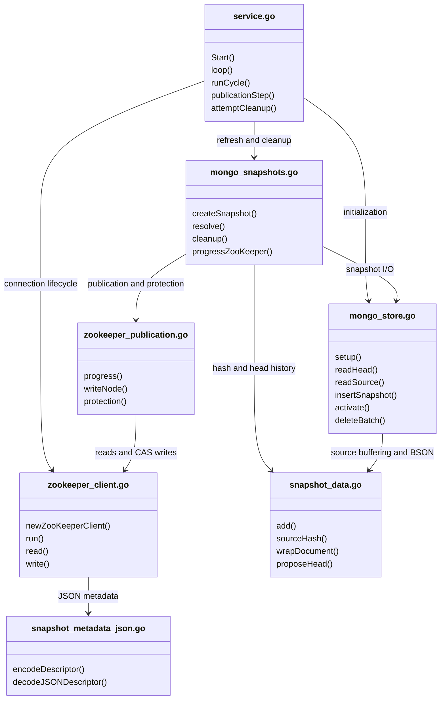
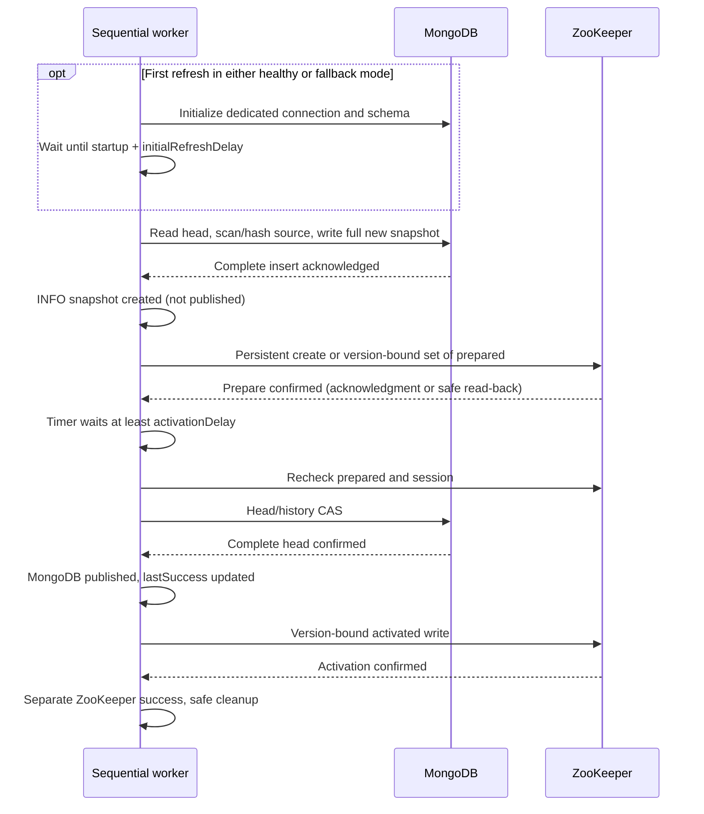

<!--
Copyright 2026 Deutsche Telekom AG

SPDX-License-Identifier: Apache-2.0
-->

# Subscription snapshots

Normal flow, shown separately for Quasar and the consumer:

```text
Quasar:
Read subscriptions from MongoDB -> save a complete snapshot in MongoDB
  -> set ZooKeeper prepared -> wait activationDelay
  -> update MongoDB head -> set ZooKeeper activated

Consumer:
prepared  -> load snapshot from MongoDB; keep using the current cache
activated -> switch to the new cache once loading is complete
```

- ZooKeeper stores only snapshot metadata, not subscription data.
  Quasar does not wait for consumers to finish loading.
- Snapshots are never changed after creation.
- The worker runs in both provisioning and watcher mode. The API or Kubernetes
  watcher does not wait for snapshot creation or ZooKeeper activation to become ready.
- Own MongoDB client/session and ZooKeeper connection; not a `DualStoreManager` store.
- The MongoDB **head** identifies the currently published snapshot.
- Ordered publication across both systems, not a cross-system transaction.

## Automatic setup

When snapshots are enabled:

- The source collection must already exist; the snapshot worker only reads it.
- Quasar creates the snapshot/head collections with strict schema validators
  and installs the required snapshot indexes.
- Compatible existing collections are reused. Incompatible collection options
  are rejected and require manual migration.
- Missing ZooKeeper parent paths and persistent `prepared`/`activated` nodes
  are created during publication. Existing parent data and node ACLs are preserved.

## File/function overview

Each box is a production file, not a Go type. Functions omit receivers;
arrows show the main cross-file calls, including interface calls.



| File in `internal\snapshot` | Responsibility |
| --- | --- |
| `service.go` | Sequential event loop, deadlines, refresh requests, bounded retries and I/O timeouts. |
| `mongo_snapshots.go` | Create/confirm a pending MongoDB head update (**proposal**), track `lastSuccess` and delete unprotected snapshots. |
| `zookeeper_publication.go` | Prepare/activate one fixed publication target (**candidate**), catch up to the latest confirmed head and protect references. |
| `zookeeper_client.go` | Shopify/zk connection, synchronized reads, version-checked writes and SDK logs. |
| `mongo_store.go` | MongoDB I/O, validators and indexes. |
| `snapshot_data.go` | BSON representation, source buffering, hashing and head/history comparisons. |
| `snapshot_metadata_json.go` | Encode/decode the strict ZooKeeper JSON contract. |

## Lifecycle



### Startup

```text
Start worker -> initialize MongoDB; start ZooKeeper connection asynchronously
             -> wait until worker start + initialRefreshDelay
             -> scan current source -> create first snapshot -> publish
```

- The startup delay applies to every start, including bootstrap and ZooKeeper outages.
- Ticks and connection events neither reset nor bypass it; `0` disables it.
- A process stopped before the deadline creates no snapshot or prepare.
- The first refresh attempts a new snapshot, even if the source is unchanged.
- A restart replaces an old prepare through normal publication; the existing
  activated version stays until the new activation.
- Neither startup nor activation waiting consumes an I/O timeout or gates other services.

### Normal publication

```text
Read head -> check active count -> scan/hash source -> insert complete snapshot
  -> confirm ZooKeeper prepared -> wait at least activationDelay
  -> recheck prepared/session -> MongoDB head/history CAS -> confirm head
  -> confirm ZooKeeper activated -> eligible cleanup
```

- CAS (compare-and-swap) updates only the expected previous version.
- A failed insert is never prepared or published; leftover rows are orphans.
- `prepared` remains after activation; no consumer acknowledgment is required.
- Later refreshes reuse a complete snapshot when the source hash is unchanged.
- Creation reasons: `initial`, `snapshot_count_mismatch`, `restart`, `source_changed`.
- MongoDB publication and ZooKeeper activation are separate successes.
  API readiness does **not** mean ZooKeeper is current.

### Refresh and retry

```text
Refresh tick -> scan, or remember one refresh behind an open MongoDB proposal
Refresh / deadline / eligible connection event -> advance publication
  -> after proposal confirmation: consume the remembered refresh in the same cycle
  -> at most one eligible regular cleanup attempt -> wait for next event
```

- One sequential worker; repeated ticks coalesce into one refresh, not a queue.
- Follow-up snapshots get their own full activation delay in healthy mode.
- An unresolved MongoDB CAS blocks the next MongoDB proposal.
- Refresh ticks release retry blocks. A newly usable ZooKeeper session permits one
  earlier ZooKeeper retry per wake window; the startup deadline permits the initial refresh.
- Ticks recheck connection state; repeated SDK events and expired timers do not
  cause tight retry loops or repeated failed source scans.

## ZooKeeper outage and recovery

```text
Outage:     MongoDB A -> B -> ... -> F; ZooKeeper remains at A
Recovery:   prepare F -> full activationDelay -> activate F; MongoDB stays at F
New G:      finish fixed F -> prepare latest G -> full delay -> activate G
```

- No usable session (`StateHasSession` absent) or a ZooKeeper operation error
  enables MongoDB fallback. After startup waiting, publish complete heads without
  the activation delay, using a fresh MongoDB timeout.
- ZooKeeper outages do not terminate Quasar or change readiness.
  Initial MongoDB connection/ping failures are fatal.
- Keep one fixed ZooKeeper candidate until resolved; newer confirmed MongoDB heads
  replace only the catch-up target. Resolve an older uncertain/prepared candidate first.
- Catch-up does not create a snapshot, rescan the source or update the MongoDB head.
- Reconnection in the same process preserves the candidate and preparation timer;
  a process restart creates a new startup snapshot.
- The SDK refreshes DNS resolution on reconnect and after exhausting server
  addresses, so changed server IPs do not require restarting Quasar.

```text
Uncertain write -> keep expected node identity/version and descriptor
  -> Sync + Get in one connection/session -> confirm only the expected transition
```

- A timeout/cancellation/network error after an SDK write call is not proof of failure.
  An old-value read or rejected retry does not rule out a still-pending write.
- ACL/read failures retry automatically. Unknown identities/versions, contradictory
  metadata or disappearing observed nodes block ZooKeeper progress and cleanup until resolved.
- Never repair with an unconditional set. `Czxid` detects node recreation, not foreign-writer fencing.

## ZNode and consumer contract

Default nodes: `/horizon/subscriptions/prepared` and `/horizon/subscriptions/activated`.
Both are persistent and contain exactly this JSON shape:

```json
{
  "snapshotId": "<24 lowercase hex characters>",
  "sourceHash": "<64 lowercase SHA-256 hex characters>",
  "documentCount": 120,
  "createdAt": "2026-09-30T15:00:00Z"
}
```

| Field | Rule |
| --- | --- |
| `snapshotId` | 24 lowercase hex characters (MongoDB ObjectID). |
| `sourceHash` | 64 lowercase SHA-256 hex characters. |
| `documentCount` | Nonnegative integer; `0` is a valid empty snapshot. |
| `createdAt` | ObjectID timestamp in UTC RFC3339 with trailing `Z`. Zero-only fractions such as `.000Z` are accepted; nonzero fractions and offsets are not. |

Missing, null, duplicate or extra fields are invalid. Leaf nodes are never empty
placeholders; missing parents are created without replacing existing data or ACLs.

### MongoDB data

- Source `_id` must be a string; scan in binary ID order and buffer within `maxSnapshotBytes`.
- Hashing sorts object fields but preserves array order and scalar BSON types.
- Snapshot rows contain a new `_id`, `snapshotId`, `subscriptionId` (source `_id`)
  and `resource` (remaining original BSON, preserving field order).
- Immutable snapshots are inserted in batches; head metadata uses the same descriptor
  with BSON types. `recentSnapshots` includes the active descriptor.
- Primary/majority reads, journaled majority writes and one persistent causal session.
- Completeness checks compare document counts, not hashes of stored contents.

### Consumer flow

```text
prepared -> preload complete snapshot -> activated -> switch cache
ZooKeeper unavailable / no activated -> read confirmed MongoDB head
  -> pin snapshot ID -> load and validate full snapshot -> switch cache
```

- Read current nodes at startup/reconnect, renew watches and handle duplicates safely.
  Watches are not a queue; a missed prepare must not prevent loading an activated snapshot.
- Serialize or coalesce cache loads. Discard partial results; if cleanup intervenes,
  reread the head. There is no reader lease or guaranteed retention grace period.
- Return from fallback only when the **full activated descriptor** matches the
  locally applied version or a freshly read MongoDB head. Never replace MongoDB G with lagging ZooKeeper F.
- ObjectID order and `createdAt` do not guarantee global version order.
- On failure, keep the last complete cache and report the error.
  Java consumer implementation/rollout is separate; Go tests simulate this contract.

## Cleanup

```text
Pending cleanup -> validate retained snapshots and publication references
  -> find unprotected versions -> recheck head + synchronized ZooKeeper before each batch
  -> delete batches -> clear cleanupDue only after success
```

- Protect MongoDB head/history, both ZooKeeper nodes and the latest catch-up target.
  Open MongoDB proposals or ZooKeeper candidates, and no activation yet confirmed
  by this process, defer deletion.
- Changed, unknown, unreadable or incomplete protected state stops deletion.
  The same checks apply to orphans left by failed inserts.
- One regular attempt per eligible event cycle, after publication work.
  Failure/deferment stays pending until a later refresh, deadline or usable recovery event;
  unchanged source does not prevent retries.
- Offline SDK wakeups alone do not trigger cleanup. A remembered refresh consumed
  during that wake still permits its regular attempt.
- Orphan deletion before a source scan is separate from the one-attempt limit.
  Deferred orphans do not block scanning; later cleanup scans rediscover them.
- No age cutoff or TTL. Long ZooKeeper outages can grow MongoDB storage;
  do not weaken protection to reclaim space.

## Configuration

Keys below are relative to `subscriptionSnapshots`.

| Key | Default / requirement |
| --- | --- |
| `enabled` | `false`; disabled means no connections or database changes. |
| `uri`, `database` | Explicit MongoDB URI and database required when enabled; URI must not weaken consistency. |
| `sourceCollection` | `subscriptions.subscriber.horizon.telekom.de.v1` |
| `snapshotCollection` | `subscriptions.subscriber.horizon.telekom.de.v1-snapshots` |
| `headCollection` | `subscriptions.subscriber.horizon.telekom.de.v1-head` |
| `refreshInterval` | `300s` |
| `initialRefreshDelay` | `120s`; nonnegative, `0` disables startup waiting. |
| `activationDelay` | `60s`; starts after confirmed preparation. |
| `refreshTimeout`, `cleanupTimeout` | `60s` each; active I/O budgets, not waiting time. |
| `minimumRetainedSnapshots` | `3`; head history size including the active descriptor, range `3..100`. |
| `maxSnapshotBytes` | `67108864` (64 MiB source BSON payload, not total process memory). |
| `zookeeper.addresses` | Explicit `host:port` list required when enabled; no separate ZooKeeper enable flag. |
| `zookeeper.basePath` | `/horizon/subscriptions` |
| `zookeeper.sessionTimeout` | `10s` |

- Collections must be valid and distinct; all durations except `initialRefreshDelay` must be positive.
- Standard Go duration syntax is accepted; defaults use seconds.
- Environment example: `QUASAR_SUBSCRIPTIONSNAPSHOTS_ZOOKEEPER_ADDRESSES=host-a:2181,host-b:2181`.
- ZooKeeper attempt timeout: `min(5s, refreshTimeout)`; cleanup protection reads: `min(5s, cleanupTimeout)`.
- Shutdown cancels waits immediately and closes owned resources with a ten-second budget.

## Logs

Messages below have the prefix `Subscription snapshot`. Durations are numeric milliseconds.

| Message | Level | Meaning / `durationMs` |
| --- | --- | --- |
| `created` | INFO | Complete insert, not publication. Snapshot creation step, including checks and orphan work. |
| `source unchanged` | DEBUG | Reused complete snapshot. Same step without insert; `lastSuccess` stays unchanged. |
| `published` | INFO | MongoDB head confirmed; updates `lastSuccess`. Since snapshot creation began, including retries/waits. |
| `ZooKeeper prepared` | INFO | Prepare confirmed. Since this fixed ZooKeeper candidate began. |
| `ZooKeeper activated` | INFO | Activation confirmed. Same candidate start, including waits/recovery. |
| `cleanup completed` | DEBUG | Successful regular attempt. Cleanup duration; `deletedDocuments` counts its acknowledged deletions, including `0`, excluding separate orphan deletion. |

- Creation timing excludes initialization, startup waiting, publication and regular cleanup.
  Publication durations overlap; do not sum them.
- Queued refreshes emit no result; publication retries do not repeat `created`.
  Failures emit errors, deferred cleanup a warning, never a success total.
- SDK records are forwarded immediately with `source="zookeeper-sdk"`, original
  message, severity and optional error text; other attributes are discarded.
  Error text can contain network addresses.
- DNS-refresh failures use the SDK host provider's global `slog` logger, not the
  client logger above. They remain plain-text records with the default logger;
  Quasar does not change the global `slog` configuration.

## Operation and development

- **Single publisher:** deploy one replica, no autoscaling, `Recreate`.
  CAS and `Recreate` do not stop isolated old processes or foreign writers from writing.
- **ZooKeeper access:** new nodes use `world:anyone` with all rights, without credentials;
  existing ACLs stay unchanged. Production authentication/TLS/ACL policy is not implemented.
- **External deployment:** Helm/ArgoCD configuration and live endpoints are outside this repository.
  Verify rendered settings and connectivity separately; preserve explicit `initialRefreshDelay: 0`.
  Config changes require a process restart.
- **Runtime:** Go 1.26.0+; Docker builds with `golang:1.26-alpine`.
  Static CGO-free binary on `scratch`; no Java needed by Quasar.
- **Tests:** production files have matching tests; separate startup-delay, client-fault
  and simulated consumer tests cover timing/recovery. Dockertest uses isolated MongoDB
  replica sets and ZooKeeper ensembles; image defaults are in `internal/test/docker.go`
  (`zookeeper:3.9.5-jre-17`, overridable with `ZOOKEEPER_IMAGE`/`ZOOKEEPER_TAG`).
- **Fixture safety:** existing tests bind ports `27017`/`5701`; do not use forwarded
  cluster services or stop unrelated processes. Use an isolated Docker daemon on conflicts.
  Remote fixtures use `MONGO_HOST`/`ZOOKEEPER_HOST` or `DOCKER_HOST`;
  Docker Desktop container clients need `host.docker.internal` to reach host-published ports.
